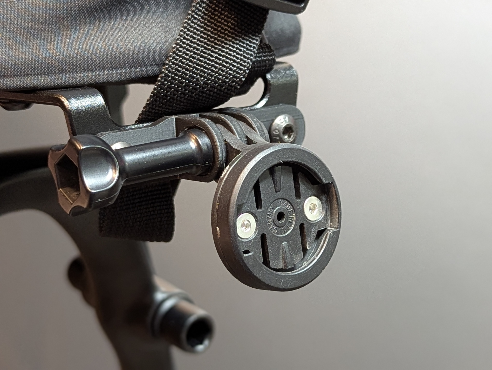
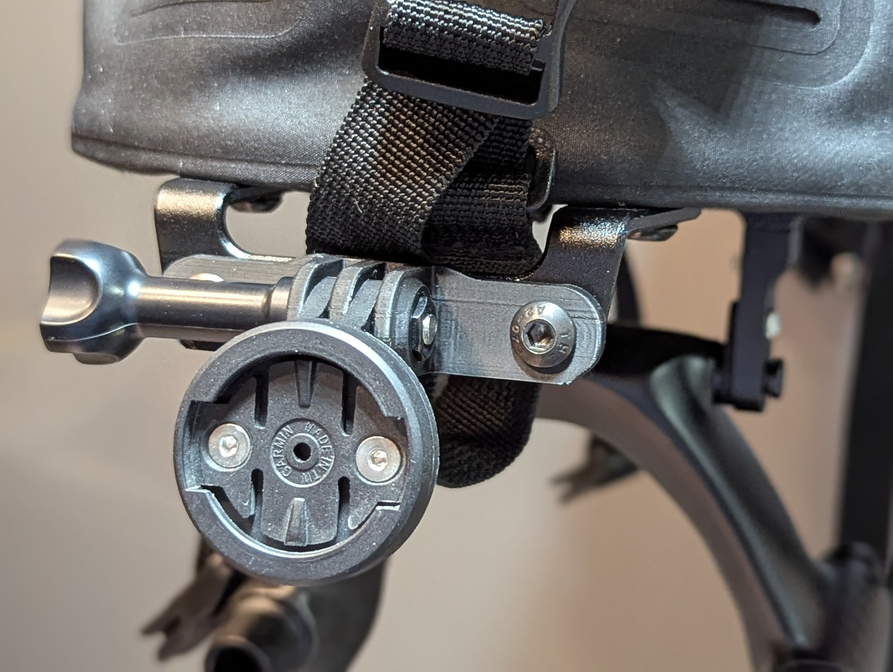
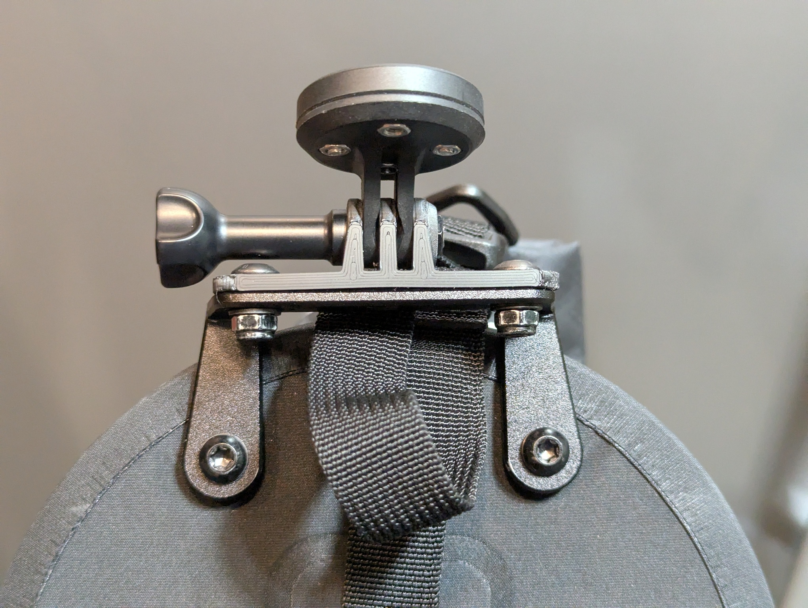

# Tailfin AeroPack Taillight GoPro-Style Mount

This mount allows for the use of GoPro-style accessories on the back of
the Tailfin AeroPack.  This mount attached to the tail light mount sold as
"Light Mount (Fixed)" by Tailfin.

Accessories such as the Garmin Varia RTL515 can be mounted using a Garmin
Quarter Turn adapter such as the one here:
https://www.amazon.com/gp/product/B085BDZFH9/.

# License

Creative Commons Attribution-Noncommercial-Share Alike
https://creativecommons.org/licenses/by-nc-sa/4.0/

Author assumes no responsibility for any use of this model.
